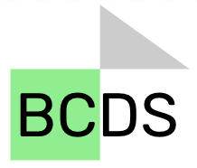

# **Baltimore Community Data Science**

<div class = "banner">
Welcome to the course website for Baltimore Community Data Science (PH140.840)!  
</div>

### **About**
This course was developed in partnership with [SOURCE](https://source.jhu.edu/), the community engagement and service-learning center at the Johns Hopkins Bloomberg School of Public health, which is focused on community engagement that involves:  
**Social Change / Authentic Relationships / Redistributing Power**

```{r, fig.align='center', fig.alt= "BCDC logo", echo = FALSE}

```

 
### **Logistics**

This course will be taught the **3rd and 4th terms** of this academic year (2021-2022) as a special topics course. 

Class will be **on Zoom** but with an optional location at the school of public health (W3031) for students to work together. 

Most communications will be through Slack. A link to join the Slack workspace will be emailed to students.

Class sessions will be **Friday 1:30- 3:00 PM EST**.

### **Main Goal**

This course is focused on helping students learn how to apply their data science knowledge in non-academic settings. Students will partner with community-based organizations (CBOs) in Baltimore to work on a data science related goal.

Students will work in teams with a CBO to:

- develop **data science products** (such as a dashboard, data analysis, series of visualizations, etc.)

- develop **training material** for CBO users to use and implement the products

- develop **sustainability / maintenance plans** for CBOs to continue with the data science product

Students will focus on developing:

- data science skills
- professional skills
- critical service learning skills

Students will **reflect on their role** as a statistician in society.

They will learn more about being **mindful and ethical** practitioners of data science techniques **to advocate for social change**.

<div class = "center">
"Working with community-based organizations in Baltimore to support data science related goals"  
</div>


